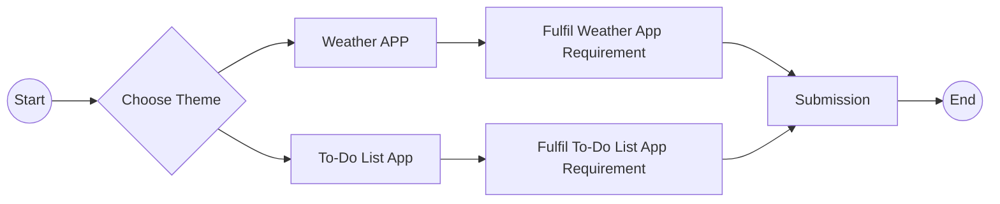

# :art: POROS 2023: Front-End Free Pass Challenge 

**Front-End Free Pass Challenge** merupakan salah satu jalur penerimaan calon anggota baru Divisi Front-End, Departemen Research and Development, POROS 2023. Pada *free pass challange* kali ini calon anggota diminta untuk menyelesaikan salah satu tantangan/challenge yang sudah disediakan di bawah. 

## :surfer: Challenge 

Pada free pass challenge kali ini terdapat 3 tema aplikasi yang dapat peserta pilih, yaitu **weather app**, **movies app**, dan **todo-list app**. Terdapat pula beberapa hal yang dapat menjadi perhatian `(requirement)` guna memaksimalkan nilai pengerjaan tantangan ini :

> 1. Menggunakan framework/library React JS
> 2. Implementasi State Management System
 >3. Implementasi tampilan yang responsive
 >4. Implementasi animasi/efek transisi

### :umbrella: Weather App 
Hal yang perlu diperhatikan `(requirement)` jika memilih tema ini :

 >1. Gunakan Weather API untuk mengembangkan aplikasi (example: [weatherapi.com](https://www.weatherapi.com/docs/)) 
 >2. Tambahkan error handling (example: Toast/Alert/Notification)

    * Diperbolehkan menggunakan Weather API lainnya

### :ledger: To-Do List App
Hal yang perlu diperhatikan `(requirement)` jika memilih tema ini :

> 1. Manipulasi web persistent storage (example: LocalStorage, recommend: IndexedDB)
 >2. Tambahkan error handling (example: Toast/Alert/Notification)

## About This Repo

Repository ini sudah terintegrasi dengan Vite JS sebagai *Development Environment* untuk *React JS*. Peserta *freepass challenge* diperbolehkan **(tidak wajib)** untuk menggunakan kode pada repo ini sebagai kerangka kerja awal.

## :hourglass_flowing_sand: Deadline

Batas waktu pengumpulan *Free Pass Challenge* ini adalah pada **Rabu, 22 Februari 2023** pukul **23:59 WIB**

## :postbox: Submission

Bagi peserta yang sudah menyelesaikan salah satu dari ketiga tantangan di atas maka dipersilahkan untuk mengisi form pengumpulan tugas berikut ini: 	 [Submission Form](form.google.com) 

## :warning: Attention

Mohon perhatian penuh terhadap beberapa hal berikut :

> 1. Peserta tidak diwajibkan untuk menggunakan repository ini sebagai kerangka kerja awal
> 2. Diperbolehkan menggunakan library external dalam mengembangkan aplikasi
> 3. Diperbolehkan menggunakan design aplikasi dari sumber eksternal
> 4. Petunjuk pengumpulan tertulis pada submission form
> 5. Peserta dipersilahkan untuk membuat fitur berdasarkan kemampuan dan kreatifitas masing-masing

## :raised_hand: Questions

Jika terdapat hal yang ingin ditanyakan terkait *Free-Pass Challenge* POROS 2023, silahkan hubungi salah satu dari *Contact Person* berikut :

|No.|Nama|Contact|
|--|--|--|
|1|Kevin|[WhatsApp](https://wa.me/081380859045)|
|2|Rizaldi|[WhatsApp](https://wa.me/081392792854)|

## :bookmark: Summarizing

Berikut di bawah ini terdapat flowchart yang menggambarkan tahapan pengerjaan *Free-Pass Challenge* kali ini 

